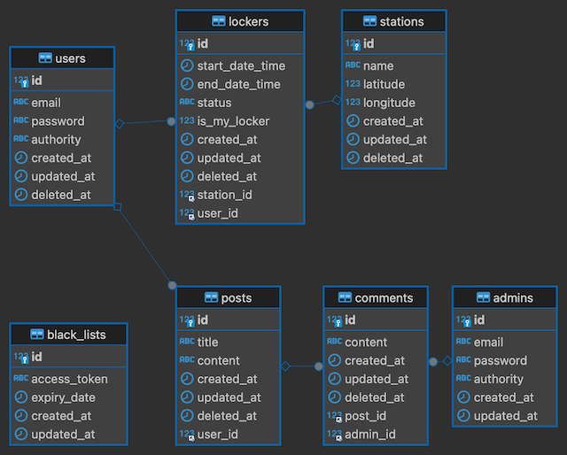

<!--
[](https://nodejs.org/en)
[](https://nodejs.org/en)
[](https://developer.mozilla.org/en-US/docs/Web/JavaScript)
[](https://sequelize.org/)
[](https://www.mysql.com/)
-->


# Mini Project : Subway Locker Rental Service

## Purpose of this project
- Recreate a real-world service for practical experience
- Lightweight implementation of the Front-end using JavaScript, HTML, and CSS 
- Understand interaction between Front-end and Back-end
- Applied back-end concepts in practice
  - API naming conventions
  - RESTful design principles
  - HTTP status codes
  - Middleware implementation
  - Function-level logic


## Features Implemented

### 1. Station Map
- **Display station locations on a map**
  - Implemented using [Leaflet](https://leafletjs.com/)

### 2. Station Interaction
- **Click a station to view current weather and locker status**
    - Weather data fetched from [OpenWeather API](https://openweathermap.org/api)
    - Locker status shown with different colors:
      - Available / In Use / Under Maintenance 

### 3. User Account Management
- **Sign up / Log in / Log out**
    - Implemented with JWT authentication
 
### 4. Role-Based Access Control
- Role verification using **custom middleware**
  - authorityConfirmation.js

### 5. Message Board (Q&A)
- Post messages and reply to messages
    - Users can post messages
    - Admins can reply to message

### 6. My Page (User Dashboard)
- **Personalized dashboard for users**
    - Return rented lockers
    - Delete account
    - View own posts and comments

### 7. Admin Page
- **Admin control panel**
    - Manage stations, lockers, posts, comments, and user accounts
    - Features: delete, restore, edit

## Database ERD


## Stack
Back-end
- Language: JavaScript
- Runtime: Node.js
- Framework: Express.js
- DBMS: MySQL
- ORM: Sequelize
- Authentication: JWT
- Deployment: AWS EC2

Front-end
- Language: JavaScript
- Markup & Styling: HTML, CSS
- Map Library: Leaflet (map)
- API: OpenWeather API


## Project Structure
### Back-end
```
Back-end
├── app.js
├── config
├── functions
├── middleware
│   ├── HttpException.js
│   ├── authenticateToken.js
│   ├── authorityConfirmation.js
│   └── index.js
├── models
│   ├── Admin.js
│   ├── BlackList.js
│   ├── Comment.js
│   ├── Locker.js
│   ├── Post.js
│   ├── Station.js
│   ├── User.js
│   ├── enums
│   └── index.js
└── routes
    ├── auth.js
    ├── comments.js
    ├── index.js
    ├── lockers.js
    ├── posts.js
    ├── stations.js
    └── user.js
```
### Front-end
```
Front-end
├── css
├── images
│   └── train.png
├── public
│   ├── admin.html
│   ├── index.html
│   ├── message-board.html
│   ├── my-page.html
│   ├── search-lockers.html
│   ├── sign-in.html
│   └── sign-up.html
└── src
    ├── admin-script.js
    ├── button.js
    ├── main.js
    ├── message-borad.js
    ├── my-page.js
    ├── search-locker-script.js
    ├── sign-in-script.js
    └── sign-up-script.js
```
